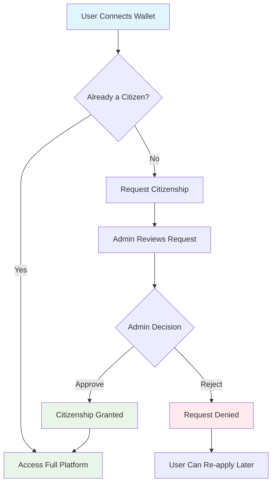
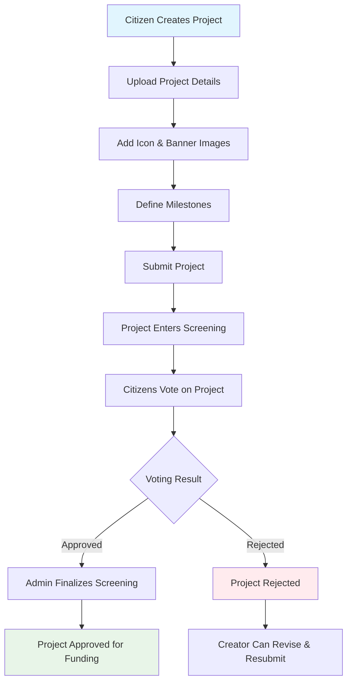
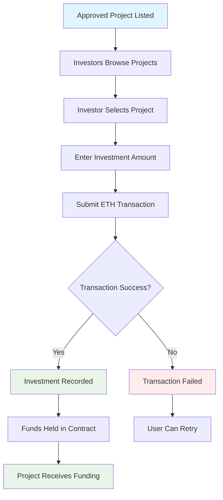
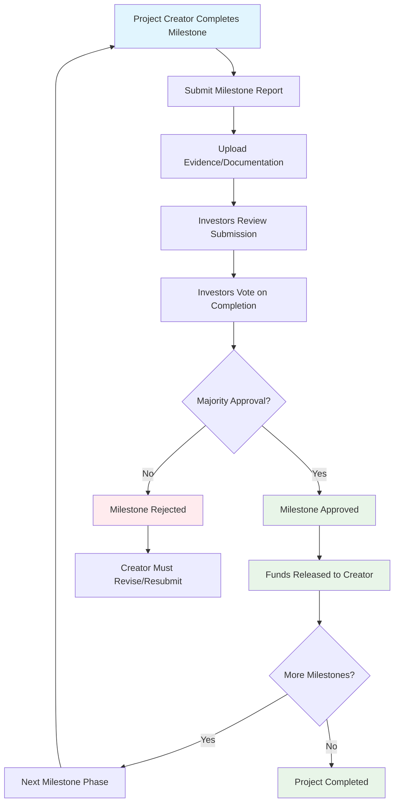
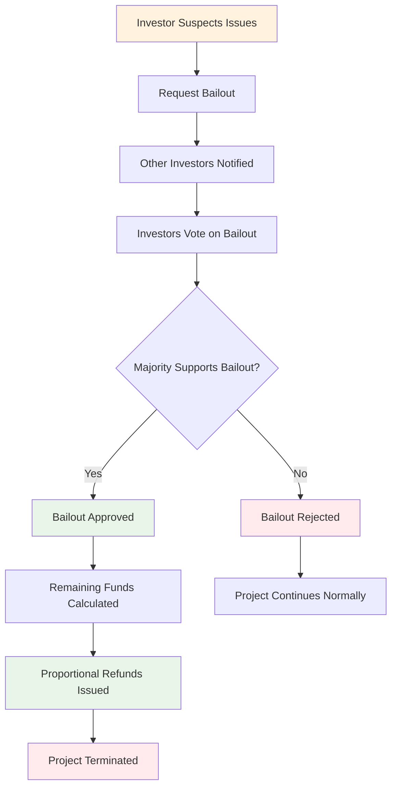
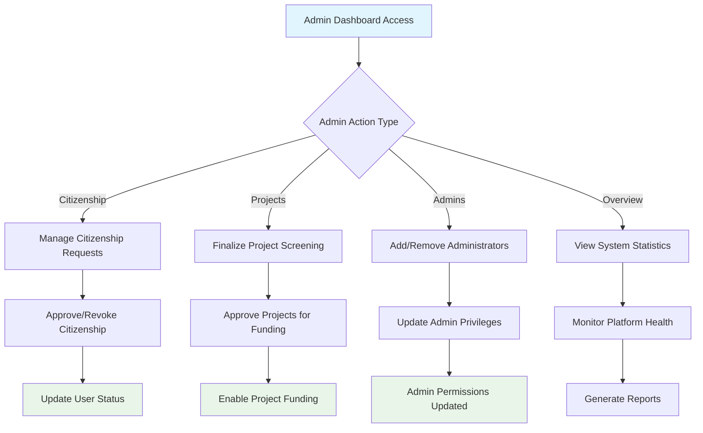
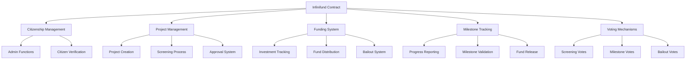

# Infinifund

**Infinifund** is a decentralized crowdfunding platform for urban public goods, built on Base Sepolia (ETH). It enables communities to propose, fund, and transparently manage city projects through milestone-based funding and community-driven governance.

## Project Vision

Infinifund bridges the gap between urban development and blockchain by empowering citizens, investors, and project creators to collaborate with trust and transparency. The platform ensures accountability, protects investors, and fosters collective decision-making for better cities.

## Core Features

- **Citizenship Management:**  
  Admins verify and manage citizens. Only citizens can submit projects and vote in screening rounds.

- **Project Lifecycle:**  
  Projects go through a screening round (citizen voting), then a funding round (open to all). Only approved projects are eligible for funding.

- **Milestone-Based Funding:**  
  Funds are released in stages as project creators submit milestone reports. Investors vote to approve milestone completion before funds are unlocked.

- **Investor Protection:**  
  Investors can request a bailout if fraud is suspected. If the majority agrees, remaining funds are refunded.

- **Investor Leaderboards:**  
  Showcases top investors by participation and contribution to the platform.

- **User Profiles:**  
  Users can customize profiles with avatars (IPFS), social links, and view their created and funded projects.

## Platform Workflows

### 1. User Onboarding & Citizenship Workflow



### 2. Project Creation & Screening Workflow



### 3. Investment & Funding Workflow



### 4. Milestone Completion & Fund Release Workflow



### 5. Investor Bailout & Protection Workflow



### 6. Admin Management Workflow



## Technical Architecture

### Smart Contract Structure



## Technology Stack

- **Blockchain:** Base Sepolia Testnet (ETH)
- **Smart Contracts:** Solidity
- **Frontend:** Next.js 14, TypeScript, TailwindCSS
- **Web3 Integration:** Wagmi, RainbowKit, Viem
- **Storage:** IPFS (Pinata) for images and files
- **UI Components:** Radix UI, Lucide Icons
- **Notifications:** Sonner Toast

## Contract Address

**Base Sepolia:** `0xCa36dD890F987EDcE1D6D7C74Fb9df627c216BF6`

## Key Features Implementation

### 🏛️ Citizenship System
- Manual admin approval for new citizens
- Role-based access control
- Citizen-only project creation and voting

### 📊 Project Lifecycle
1. **Pre-listing Phase:** Citizen voting on project proposals
2. **Approved for Funding:** Public investment opportunities
3. **Milestone-Based:** Progressive fund release

### 💰 Investment Protection
- Transparent fund tracking
- Majority-based milestone approval
- Emergency bailout mechanisms

### 🏆 Investor Recognition
- Real-time leaderboards
- Investment tracking
- Community recognition system

## Development Setup

1. **Clone the repository**
   ```bash
   git clone https://github.com/your-repo/infinifund
   cd infinifund
   ```

2. **Install dependencies**
   ```bash
   npm install
   ```

3. **Configure environment variables**
   ```bash
   cp .env.example .env.local
   # Add your API keys and contract addresses
   ```

4. **Run development server**
   ```bash
   npm run dev
   ```

## Contributing

We welcome contributions to improve Infinifund! Please read our contributing guidelines and submit pull requests for any enhancements.

## License

This project is licensed under the MIT License.

---

**Infinifund: Transparent, Community-Driven Urban Crowdfunding on Base.**
